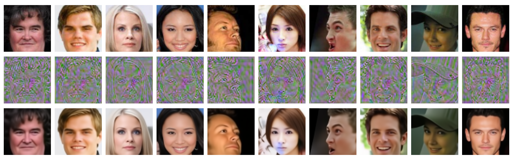
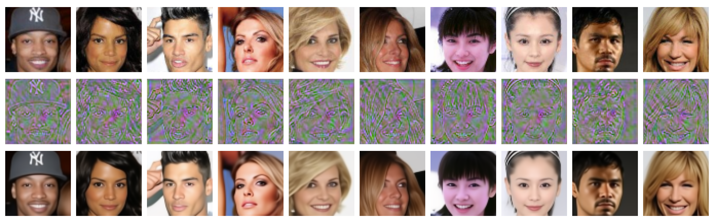
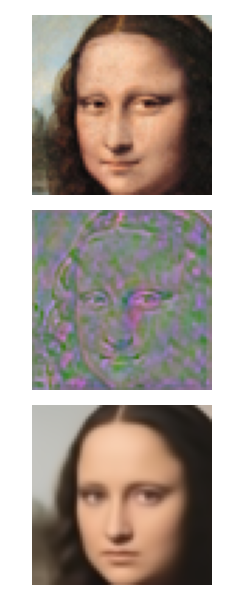
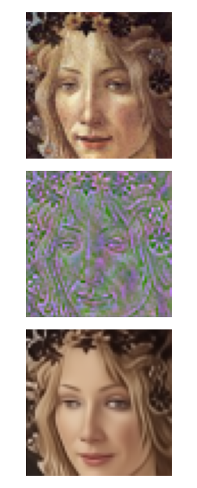
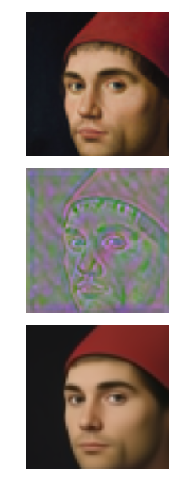
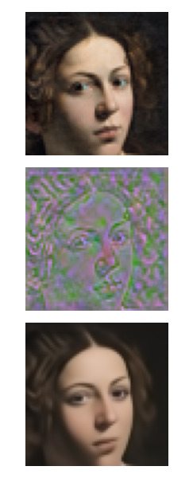

# Embedding-in-Diffusion-Models
Repository relative to the article "Image embedding for Denoising Generative Models", joint work with D.Evangelista, S.Marro and F.Merizzi.

# Objective
A diffusion model generate consists of a single network trained to denoise data with a parametric amount of noise; then, new samples are generated by iteratively
denoising pure random noise. In the case of so called "implicit" models (DDIM), the generative process is deterministic, hence it becomes interesting to address the 
embedding tasks, that consists in finding a suitable “noisy” image whose denoising results in the original image. In this way, we obtain a functionality similar to an "encoder" in Variational Autoencoders, or a so called recoder for Generative Adversarial Networks.

In the framework of Denoising Models, the task is in this case made more complicated by the non-injective nature of the generator: for each sample x there exists a cloud of elements z able to generate x; we call this set the embedding of x, denoted as emb(x). The task of the Embedding Network is to choose a canonical element
in emb(x). We did a deep investigation of the typical shape of emb(x), aimed to better understand their structure: do they intersect each other? are they simply connected? maybe convex?

# Approach
For the embedding task, we considered both gradient descent approaches,
as well as the definition and training of specific Embedding Networks. The code for both apporaches in contained in this repository.

Among all the architectures for Embedding Networks tested so far, a Unet obtained the best results. The quality
of the embedding is very good, as it can be appreciated by the following pictures, relative to the CelebA dataset

  
  <em>Embedding examples for the CelebA dataset.   In the first row there
is the original, in the second row the synthesized latent seed, and in the third
row the reconstructed image</em>

<!-- 

 -->

# Applications
The availability of an Embedding Network has a lot of interesting applications, mostly related to the semantic exploration of the latent space, 
the disentanglement of the different aspects of variations, and the definition of interesting trajectories for data editing.

A typical application of the embedding process consists in transforming a signal into an element of the data manifold sufficiently close to it (the same
principle behind denoising autoencoders). An amusing utilization is for the reification of persons in artistic portraits, as exemplified in the picture below

  <table>
    <tr>
      <td></td>
      <td></td>
      <td></td>
      <td></td>
      <td></td>
      <td></td>
    </tr>
 <table>

